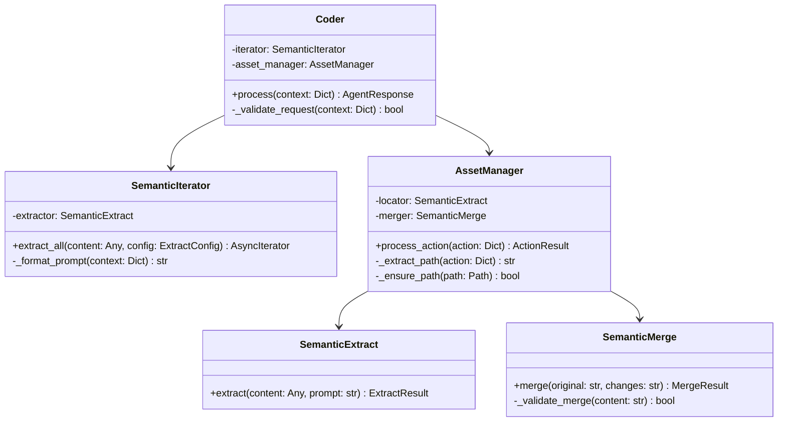
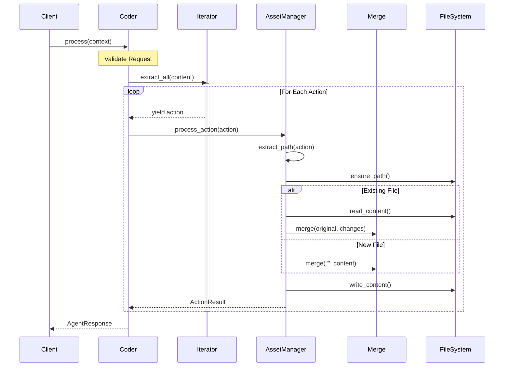
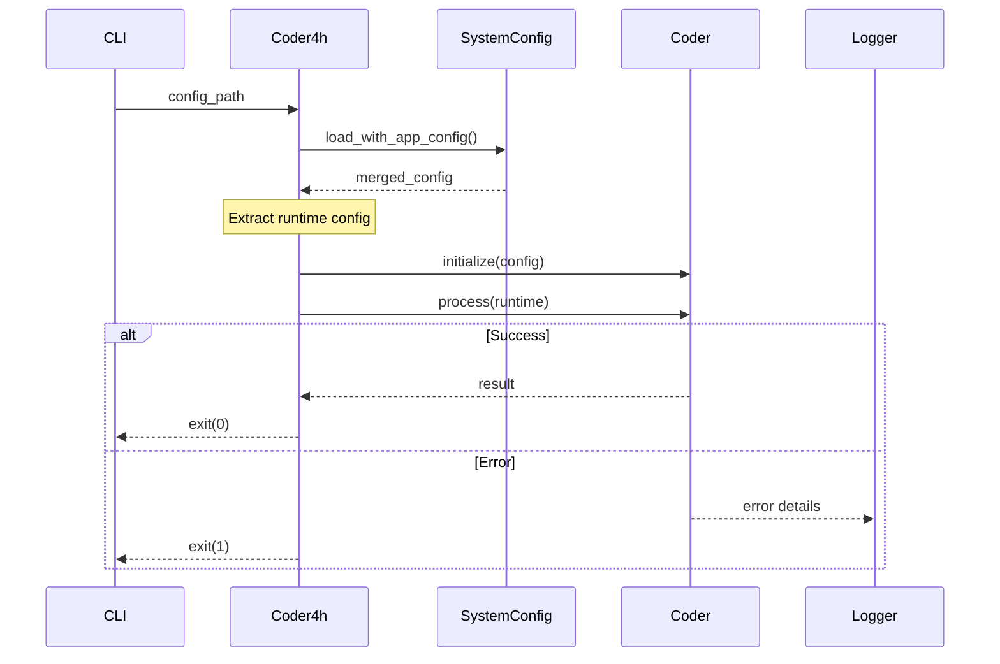
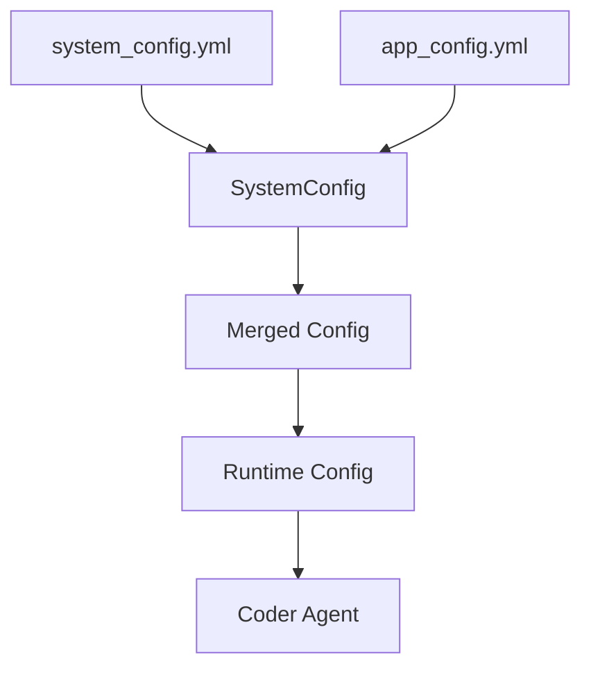

# Coder System Design
Path: design/coder_system.md

## Overview

Coder is a semantic code modification system that uses LLM capabilities to understand and apply code changes while maintaining strong separation of concerns between components.

## Core Architecture



## Component Responsibilities

### Coder
- Orchestrates overall code modification process
- Manages interaction between iterator and asset manager
- Handles high-level error cases and responses
- Maintains process state

### SemanticIterator
- Extracts actions from input content
- Provides async iteration over actions
- Handles extraction modes (fast/slow)
- Manages action format consistency

### AssetManager
- Locates target assets using LLM extraction
- Manages file system operations
- Coordinates with SemanticMerge for content changes
- Creates missing directories as needed

### SemanticMerge
- Handles intelligent code merging
- Preserves code style and structure
- Supports both modifications and new files
- Validates merged content

## Process Flow



## Configuration

### System Config (system_config.yml)
```yaml
coder:
  provider: "anthropic"
  model: "claude-3-opus-20240229"
  temperature: 0
  prompts:
    system: |
      You are a code modification expert.
      Process code changes while:
      1. Preserving functionality
      2. Maintaining style
      3. Following best practices
      4. Handling errors gracefully

asset_manager:
  prompts:
    system: |
      You are a precise file path extractor.
      Your only task is to extract the target file path from actions.
      Rules:
      1. ONLY return a single file path string
      2. Return empty string if no path found
      3. Look for "file_path" or nearest equivalent
      4. Normalize path separators
      5. Never add explanations

semantic_merge:
  prompts:
    system: |
      You are a precise code merger.
      For existing files:
      1. Preserve structure and style
      2. Apply changes consistently
      3. Maintain functionality
      
      For new files:
      1. Create with consistent style
      2. Include necessary structure
      3. Follow project conventions
```

## Implementation

### Coder
```python
class Coder:
    def __init__(self,
                 iterator: SemanticIterator,
                 asset_manager: AssetManager,
                 config: Dict[str, Any]):
        self.iterator = iterator
        self.asset_manager = asset_manager
        self.config = config

    async def process(self, context: Dict[str, Any]) -> AgentResponse:
        try:
            if not self._validate_request(context):
                return self._create_error_response("Invalid request")

            results = []
            async for action in self.iterator.extract_all(
                context['content'],
                ExtractConfig(
                    instruction=context.get('instruction', ''),
                    format=context.get('format', 'json')
                )
            ):
                result = await self.asset_manager.process_action(action)
                results.append(result)

            return self._create_response(results)

        except Exception as e:
            return self._create_error_response(str(e))
```

### AssetManager
```python
class AssetManager:
    def __init__(self,
                 locator: SemanticExtract,
                 merger: SemanticMerge):
        self.locator = locator
        self.merger = merger

    async def process_action(self, action: Dict[str, Any]) -> ActionResult:
        try:
            # Extract path using LLM
            path_result = await self.locator.extract(
                content=action,
                prompt=self._get_extract_prompt()
            )
            
            if not path_result.success:
                return ActionResult(success=False, error="Cannot locate asset")
                
            path = Path(path_result.value)
            
            # Ensure directories exist
            path.parent.mkdir(parents=True, exist_ok=True)
            
            # Get current content or empty string for new files
            current = path.read_text() if path.exists() else ""
            
            # Merge changes
            merge_result = await self.merger.merge(current, action)
            if not merge_result.success:
                return ActionResult(
                    success=False,
                    path=path,
                    error=merge_result.error
                )
                
            # Write result
            path.write_text(merge_result.content)
            return ActionResult(success=True, path=path)

        except Exception as e:
            return ActionResult(
                success=False,
                path=path if 'path' in locals() else None,
                error=str(e)
            )
```

## Action Model

```typescript
interface Action {
    // Any of these can contain the file path:
    file_path?: string;
    target?: string;
    path?: string;
    description?: string;
    instructions?: string;
    
    // Content or changes:
    content?: string;       // For new files
    changes?: {             // For modifications
        instructions: string;
        content?: string;
    };
}
```

## Error Handling Strategy

1. **Path Extraction Errors**
   - Missing path information
   - Invalid path format
   - Unauthorized locations

2. **File Operation Errors**
   - Permission denied
   - Disk full
   - File locked

3. **Merge Errors**
   - Invalid content
   - Merge conflicts
   - Syntax errors

## Testing Strategy

1. **Unit Tests**
   - Path extraction
   - Action processing
   - Merge operations

2. **Integration Tests**
   - Complete workflows
   - File system operations
   - Error scenarios

3. **Prompt Tests**
   - Path extraction accuracy
   - Merge quality
   - Error handling

## Metrics and Monitoring

1. **Performance Metrics**
   - Action processing time
   - LLM call latency
   - File operation timing

2. **Quality Metrics**
   - Successful changes
   - Extraction accuracy
   - Merge success rate

3. **Error Metrics**
   - Path extraction failures
   - Merge conflicts
   - File operation errors


# Coder4h Bootstrap Design
Path: design/coder4h_design.md

## Overview

Coder4h serves as the bootstrap component for the coder agent system. Its primary responsibilities are:
1. Configuration loading and merging
2. Coder agent initialization
3. Process execution handling
4. Error management and logging

## Current Implementation Analysis



## Component Responsibilities

### Coder4h
```python
async def run_coder(config_path: str) -> None:
    """Bootstrap coordinator responsibilities:
    1. Load and merge configurations
    2. Initialize coder agent
    3. Process request
    4. Handle errors
    """
```

### Configuration Flow


## Error Handling Strategy

1. **Configuration Errors**
   - Missing config files
   - Invalid config format
   - Missing required fields

2. **Runtime Errors**
   - Coder initialization failures
   - Process execution errors
   - System resource issues

3. **Exit Handling**
   - Success: Clean exit(0)
   - Expected failures: Logged exit(1)
   - Unexpected errors: Logged with stack trace

## Usage Example

```bash
# Direct usage
python src/coder4h.py config/my_changes.yml

# Module usage
python -m src.coder4h config/my_changes.yml
```

## Configuration Examples

```yaml
# system_config.yml
providers:
  anthropic:
    api_base: "https://api.anthropic.com"
    env_var: "ANTHROPIC_API_KEY"

# app_config.yml
provider: "anthropic"
model: "claude-3-opus-20240229"
project_path: "src/example.py"
```

## Suggested Improvements

1. **Command Line Arguments**
   - Add verbosity control
   - Support multiple config files
   - Add validation options

2. **Configuration Enhancement**
   - Support .env files
   - Add config validation
   - Allow override priorities

3. **Error Handling**
   - Add retry options
   - Improve error messages
   - Add cleanup on failure

4. **Logging**
   - Add file logging option
   - Include timing metrics
   - Add debug logging toggle

## Implementation Details

### Main Entrypoint
```python
def main() -> None:
    """CLI entry point with error handling"""
    parser = argparse.ArgumentParser(
        description="Process code changes using the Coder agent"
    )
    parser.add_argument("config", help="Path to YAML config file")
    
    try:
        asyncio.run(run_coder(parser.parse_args().config))
    except Exception as e:
        logger.error("bootstrap_failed", error=str(e))
        raise SystemExit(1)
```

### Runtime Processing
```python
async def run_coder(config_path: str) -> None:
    """Core bootstrap process"""
    try:
        # Load and merge configs 
        config = SystemConfig.load_with_app_config(
            Path("config/system_config.yml"),
            Path(config_path)
        )
        runtime = config.get_runtime_config()
        
        # Initialize coder and process
        coder = Coder(
            provider=LLMProvider(runtime['provider']),
            model=runtime['model'],
            temperature=runtime['temperature'],
            config=config.dict()
        )

        result = await coder.process(runtime)
        if not result.success:
            logger.info("coder.completed", success=False, error=result.error)
            return
            
    except Exception as e:
        logger.error("execution_failed", error=str(e))
        raise
```

## Testing Strategy

1. **Configuration Tests**
   - Valid config loading
   - Config merging
   - Invalid config handling

2. **Process Tests**
   - Successful execution
   - Error handling
   - Resource cleanup

3. **Integration Tests**
   - End-to-end execution
   - CLI argument handling
   - Exit code verification

## Metrics and Logging

1. **Key Events**
   - Configuration loading
   - Agent initialization
   - Process execution
   - Error conditions

2. **Metrics**
   - Configuration load time
   - Process duration
   - Memory usage

3. **Log Levels**
   - ERROR: Process failures
   - INFO: Process status
   - DEBUG: Detailed execution

## Dependencies

1. Required Packages:
   - structlog: Structured logging
   - pydantic: Config validation
   - PyYAML: Config file parsing

2. System Dependencies:
   - Python 3.11+
   - Async support
   - File system access

Would you like me to expand on any of these sections or provide more specific implementation details?

Some specific areas I could elaborate on:
1. Configuration validation rules
2. Extended error handling scenarios
3. Additional logging strategies
4. More complex bootstrap scenarios