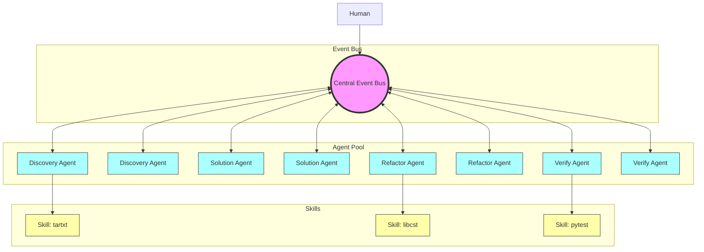
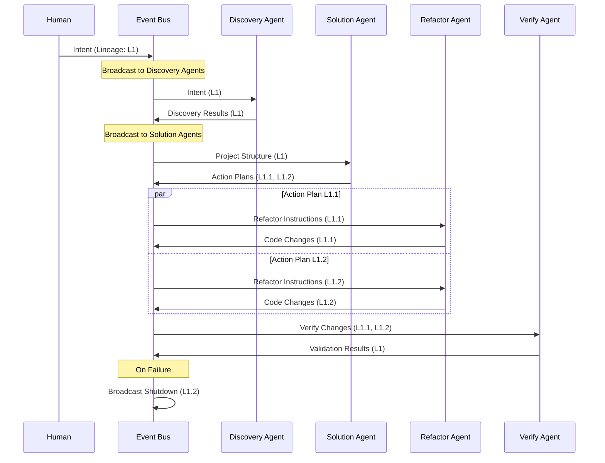

# Intent-Based Architecture Specification with AutoGen Integration

**Author**: Dimitar Popov  
**Email**: jimpopov@gmail.com  
**Date**: November 5, 2024

## Abstract

This document presents an advanced intent-based architecture leveraging Microsoft AutoGen 0.3.1 for implementing a comprehensive code refactoring system. The architecture employs an event bus model for agent communication, with explicit lineage tracking for coordinating related operations. By combining deterministic skills with Large Language Model (LLM) capabilities through a flat, scalable message-passing system, the architecture ensures reliable, traceable transformations while enabling efficient parallel processing and clean failure handling. The system demonstrates how complex refactoring operations can be managed through message-based coordination while maintaining clear boundaries and state management.

## Table of Contents
1. [System Overview](#system-overview)
2. [Event Bus Architecture](#event-bus-architecture)
3. [Lineage and Message Flow](#lineage-and-message-flow)
4. [Agent Network](#agent-network)
5. [Processing Model](#processing-model)
6. [Implementation Guidelines](#implementation-guidelines)

## System Overview

The system implements an intent-based architecture where all operations flow through a central event bus, with lineage tracking enabling coordinated agent activities and clean failure handling.

### Key Principles
- Flat event bus communication model
- Lineage-based operation grouping
- Message-driven agent coordination
- Deterministic skill execution
- Clean failure domain isolation
- Native AutoGen integration
- Horizontal scalability support

## Event Bus Architecture



### Message Flow with Lineage



## Lineage and Message Model

```python
@dataclass
class Lineage:
    """Tracks related operations through message passing"""
    root_id: UUID
    parent_id: Optional[UUID]
    branch_id: UUID
    metadata: Dict[str, Any]
    
    @property
    def path(self) -> str:
        """Returns dot-notation path of lineage"""
        return f"{self.root_id}.{self.branch_id}"

@dataclass
class Message:
    """Event bus message with lineage tracking"""
    id: UUID
    type: str
    lineage: Lineage
    content: Dict[str, Any]
    metadata: Dict[str, Any]
    timestamp: datetime

class EventBus:
    """Central message coordinator"""
    def __init__(self):
        self.subscribers: Dict[str, List[Agent]] = {}
        self.active_lineages: Set[UUID] = set()
    
    async def publish(self, message: Message):
        """Publish message to interested agents"""
        await self._route_message(message)
        
    async def subscribe(self, agent: 'Agent', message_types: List[str]):
        """Register agent for message types"""
        for msg_type in message_types:
            self.subscribers.setdefault(msg_type, []).append(agent)
            
    async def terminate_lineage(self, lineage_id: UUID):
        """Shutdown all operations for a lineage"""
        shutdown_msg = Message(
            id=uuid4(),
            type="shutdown",
            lineage=lineage_id,
            content={"reason": "lineage_terminated"}
        )
        await self.publish(shutdown_msg)
```

## Agent Implementation

```python
class Agent:
    """Base agent implementation with event bus integration"""
    def __init__(
        self,
        name: str,
        event_bus: EventBus,
        llm_config: dict
    ):
        self.name = name
        self.event_bus = event_bus
        self.llm_config = llm_config
        self.active_tasks: Dict[UUID, Task] = {}
        
    async def handle_message(self, message: Message) -> None:
        """Process incoming message"""
        if message.type == "shutdown" and \
           message.lineage.root_id in self.active_tasks:
            await self.cleanup_task(message.lineage.root_id)
            return
            
        result = await self.process_message(message)
        if result:
            await self.event_bus.publish(result)
            
    async def cleanup_task(self, lineage_id: UUID):
        """Clean up resources for terminated lineage"""
        if task := self.active_tasks.get(lineage_id):
            await task.cleanup()
            del self.active_tasks[lineage_id]
```

## Implementation Guidelines

### 1. Message Routing
- Use message types for initial routing
- Filter by lineage for related operations
- Support wildcard subscriptions
- Enable message priority

### 2. Failure Handling
- Isolate failures by lineage
- Clean shutdown of related operations
- Maintain partial results
- Support recovery strategies

### 3. Scaling Considerations
- Multiple event bus instances
- Agent pool management
- Load balancing
- State partitioning

### 4. Best Practices
- Keep messages immutable
- Include full context in messages
- Use explicit lineage tracking
- Clean up resources promptly

## Conclusion

This architecture provides a scalable, maintainable framework for intent-based operations through:
- Clean message-based coordination
- Explicit lineage tracking
- Efficient resource management
- Clear failure boundaries
- Native cloud scalability

The event bus model ensures:
- Simple agent coordination
- Clear state management
- Efficient parallel processing
- Clean failure handling
- Future scalability options

## References

1. Microsoft AutoGen 0.3.1 Documentation
2. Event-Driven Architecture Patterns
3. Cloud-Native Messaging Systems
4. Distributed Systems Design Patterns
5. Microsoft Azure Event Bus Patterns