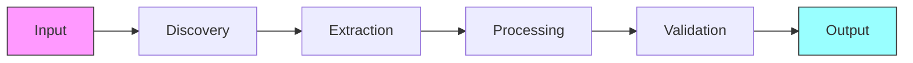
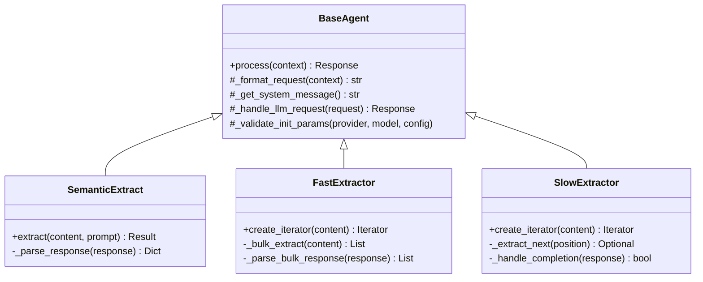
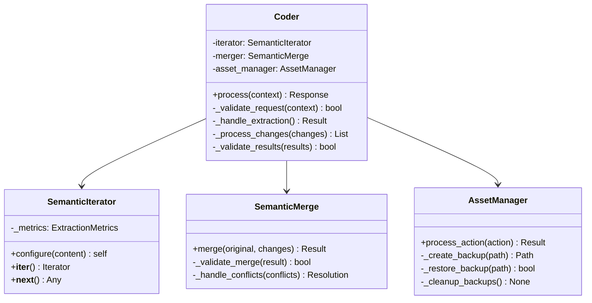

# Complete Semantic System Design

## 1. Core Agent Design Principles

### 1.1 LLM-First Processing
- Offload complex logic and decision-making to LLM
- Use LLM for understanding and validation
- Keep agent code focused on infrastructure
- Trust LLM responses without excessive validation

### 1.2 Minimal Agent Logic
- Infrastructure-only code in agents
- No business logic in agent implementation
- Simple, focused processing flows
- Direct pass-through to LLM where possible

### 1.3 Single Responsibility
- Each agent has one clear purpose
- No cross-agent processing
- Clean boundaries between components
- Trust outputs from other agents

### 1.4 Synchronous Public Interfaces
- All public methods must be synchronous
- Handle async operations internally
- Use event loops for LLM calls
- Present simple iterator patterns

### 1.5 Stateless Operation
- No shared state between operations
- Each request is self-contained
- State managed at orchestration level
- Clean operation boundaries

### 1.6 Observable Behavior
- Structured logging throughout
- Clear input/output contracts
- Traceable operation flow
- Debuggable processing

### 1.7 Forward-Only Flow
- Data flows in one direction
- No circular dependencies
- Clear progression stages
- Immutable intermediate states
- State transitions are explicit
- No backward data flow



## 2. Semantic Function Implementation

### 2.1 Base Semantic Patterns



### 2.2 Fast vs Slow Processing

#### Fast Mode
- Bulk extraction in single LLM call
- Used for structured content
- Returns complete result set
- Optimized for speed
- Falls back to slow mode if needed

Example Configuration:
```yaml
fast_extractor:
  batch_size: 100
  timeout: 30
  retry_count: 3
  validation:
    required_fields: ["id", "content"]
    format: "json"
  prompts:
    extract: "Extract all items matching pattern: {pattern}"
    validate: "Verify each item has required fields: {fields}"
```

#### Slow Mode
- Item-by-item extraction
- Used for complex content
- Stateful iteration
- Position tracking
- Complete extraction certainty

Example Configuration:
```yaml
slow_extractor:
  max_retries: 5
  position_tracking: true
  timeout: 10
  validation:
    sequential: true
    track_duplicates: true
  prompts:
    extract: "Extract item at position {position}"
    validate: "Verify item format matches: {format}"
```

### 2.3 Iterator Pattern Implementation

```python
class SemanticIterator(BaseAgent):
    """Synchronous semantic iterator implementation"""
    
    def __iter__(self):
        """Initialize iteration state"""
        self._ensure_event_loop()
        self._position = 0
        self._items = None
        return self
        
    def __next__(self):
        """Get next item with internal async handling"""
        if self._exhausted:
            raise StopIteration
            
        try:
            result = self._get_next_item()
            self._update_metrics(result)
            return result
        except Exception as e:
            self._handle_error(e)
            raise StopIteration
            
    def _ensure_event_loop(self):
        """Internal async support"""
        try:
            self._loop = asyncio.get_event_loop()
        except RuntimeError:
            self._loop = asyncio.new_event_loop()
            asyncio.set_event_loop(self._loop)
```

### 2.4 Metrics and Monitoring

```python
@dataclass
class ExtractionMetrics:
    """Standard metrics for extraction operations"""
    total_items: int = 0
    successful_items: int = 0
    failed_items: int = 0
    mode_transitions: int = 0
    llm_calls: int = 0
    start_time: float = field(default_factory=time.time)
    
    @property
    def success_rate(self) -> float:
        return self.successful_items / max(self.total_items, 1)
        
    @property
    def llm_efficiency(self) -> float:
        return self.llm_calls / max(self.total_items, 1)
        
    @property
    def processing_time(self) -> float:
        return time.time() - self.start_time
```

Standard Metrics Collection:
```python
def _update_metrics(self, operation: str, success: bool = True):
    """Update standard metrics"""
    self.metrics.total_items += 1
    if success:
        self.metrics.successful_items += 1
    else:
        self.metrics.failed_items += 1
    
    if operation == "llm_call":
        self.metrics.llm_calls += 1
    elif operation == "mode_transition":
        self.metrics.mode_transitions += 1
```

## 3. Higher Order Orchestration

### 3.1 Coder Implementation



### 3.2 Validation Scenarios

```python
class ValidationScenarios:
    """Standard validation scenarios"""
    
    async def validate_extraction(self, items: List[Any]) -> bool:
        """Validate extracted items"""
        checks = [
            self._check_required_fields(items),
            self._check_format_consistency(items),
            self._check_duplicates(items),
            self._check_relationships(items)
        ]
        return all(checks)
        
    async def validate_changes(self, changes: List[Change]) -> bool:
        """Validate code changes"""
        checks = [
            self._check_syntax(changes),
            self._check_dependencies(changes),
            self._check_side_effects(changes),
            self._check_reversibility(changes)
        ]
        return all(checks)
```

### 3.3 Backup Strategy

```python
class BackupManager:
    """Handles file backups and restoration"""
    
    def create_backup(self, path: Path) -> Path:
        """Create timestamped backup"""
        timestamp = datetime.now().strftime("%Y%m%d_%H%M%S")
        backup_path = self.backup_dir / f"{path.name}_{timestamp}"
        shutil.copy2(path, backup_path)
        return backup_path
        
    def restore_backup(self, original: Path, backup: Path) -> bool:
        """Restore from backup"""
        try:
            shutil.copy2(backup, original)
            return True
        except Exception as e:
            logger.error("backup.restore_failed", error=str(e))
            return False
            
    def cleanup_old_backups(self):
        """Remove old backups exceeding retention"""
        retention_days = self.config.get('backup_retention_days', 7)
        threshold = datetime.now() - timedelta(days=retention_days)
        
        for backup in self.backup_dir.glob("*"):
            if backup.stat().st_mtime < threshold.timestamp():
                backup.unlink()
```

### 3.4 Error Handling Strategy

```python
class ErrorHandling:
    """Centralized error handling"""
    
    def handle_extraction_error(self, error: Exception) -> Response:
        """Handle extraction phase errors"""
        if isinstance(error, LLMError):
            return self._handle_llm_error(error)
        elif isinstance(error, ValidationError):
            return self._handle_validation_error(error)
        elif isinstance(error, TimeoutError):
            return self._handle_timeout_error(error)
        else:
            return self._handle_unknown_error(error)
            
    def handle_processing_error(self, error: Exception) -> Response:
        """Handle processing phase errors"""
        if isinstance(error, MergeError):
            return self._handle_merge_error(error)
        elif isinstance(error, FileError):
            return self._handle_file_error(error)
        else:
            return self._handle_unknown_error(error)
```

## 4. Testing Strategy

### 4.1 Unit Tests
```python
class TestSemanticExtractor(unittest.TestCase):
    """Test semantic extraction functionality"""
    
    def setUp(self):
        self.extractor = SemanticExtract(
            provider=MockProvider(),
            model="test-model",
            config=test_config
        )
        
    def test_extraction_success(self):
        """Test successful extraction"""
        result = self.extractor.extract(
            content=test_content,
            prompt=test_prompt
        )
        self.assertTrue(result.success)
        self.assertIsNotNone(result.items)
        
    def test_extraction_failure(self):
        """Test extraction failure handling"""
        result = self.extractor.extract(
            content=invalid_content,
            prompt=test_prompt
        )
        self.assertFalse(result.success)
        self.assertIsNotNone(result.error)
```

### 4.2 Integration Tests
```python
class TestCoderWorkflow(unittest.TestCase):
    """Test complete coder workflow"""
    
    async def test_complete_workflow(self):
        """Test end-to-end workflow"""
        coder = Coder(config=test_config)
        result = await coder.process({
            "content": test_changes,
            "files": test_files
        })
        
        self.assertTrue(result.success)
        self.assertTrue(self._validate_changes(result.changes))
        self.assertTrue(self._check_backups(result.backup_paths))
```

### 4.3 Performance Tests
```python
class TestPerformance(unittest.TestCase):
    """Test performance characteristics"""
    
    def test_extraction_speed(self):
        """Test extraction performance"""
        start_time = time.time()
        result = self.extractor.process(large_test_data)
        duration = time.time() - start_time
        
        self.assertLess(duration, MAX_PROCESSING_TIME)
        self.assertGreater(result.metrics.items_per_second, MIN_THROUGHPUT)
```

## 5. Configuration Examples

### 5.1 System Configuration
```yaml
system:
  providers:
    anthropic:
      api_base: "https://api.anthropic.com"
      env_var: "ANTHROPIC_API_KEY"
      context_length: 200000
    openai:
      api_base: "https://api.openai.com/v1"
      env_var: "OPENAI_API_KEY"
      context_length: 128000

  llm_config:
    default_provider: "anthropic"
    default_model: "claude-3-opus-20240229"
    temperature: 0
    
  backup:
    enabled: true
    retention_days: 7
    max_backups: 5
    path: "workspaces/backups"
```

### 5.2 Agent Configuration
```yaml
agents:
  semantic_iterator:
    extraction_modes: ["fast", "slow"]
    allow_fallback: true
    batch_size: 100
    timeout: 30
    
  semantic_merge:
    merge_style: "smart"
    preserve_formatting: true
    handle_conflicts: true
    
  coder:
    max_file_size: 1048576
    backup_enabled: true
    validate_changes: true
```

### 5.3 Logging Configuration
```yaml
logging:
  level: INFO
  format: structured
  handlers:
    console:
      enabled: true
      format: "{timestamp} [{level}] {message}"
    file:
      enabled: true
      path: "logs/semantic.log"
      max_size: 10485760
      backup_count: 5
```