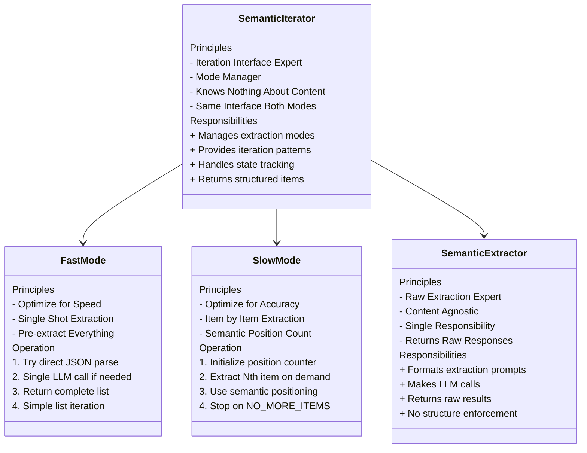

Here's the key design principles of each component:



1. SemanticIterator
   - Pure iteration expert
   - Knows nothing about content meaning
   - Provides consistent interface for both modes
   - Manages extraction state and modes
   - Simple principle: "I know how to iterate over things"

2. SemanticExtractor
   - Pure extraction expert
   - Single responsibility: get content from LLM
   - Returns raw responses
   - No understanding of structure required
   - Simple principle: "I know how to ask LLM for things"

3. Fast Mode
   - Optimized for when content can be returned as list
   - Pre-extracts everything in one shot
   - Simple list-based iteration
   - Good when LLM can return structured list
   - Simple principle: "Give me everything as a list"

4. Slow Mode
   - Uses semantic positioning for extraction
   - No list maintenance - just a counter
   - Leverages LLM's understanding of "next item"
   - Better for complex content patterns
   - Simple principle: "Give me the Nth item"

Key Design Principles:
1. Clear Separation of Concerns:
   - Iterator: manages iteration
   - Extractor: handles LLM interaction
   - Modes: define extraction patterns

2. Simple Interface:
   ```python
   iterator = SemanticIterator(config, mode='fast')
   async for item in iterator.iter_extract(content, config):
       process(item)
   ```

3. Mode Independence:
   - Same interface regardless of mode
   - Different internal strategies
   - No mode mixing unless explicitly configured

4. Content Agnostic:
   - Iterator doesn't need to understand content
   - Extractor doesn't need to understand structure
   - LLM handles semantic understanding

Would you like me to:
1. Show specific examples of these principles in action?
2. Elaborate on any particular principle?
3. Show how these principles guide error handling?