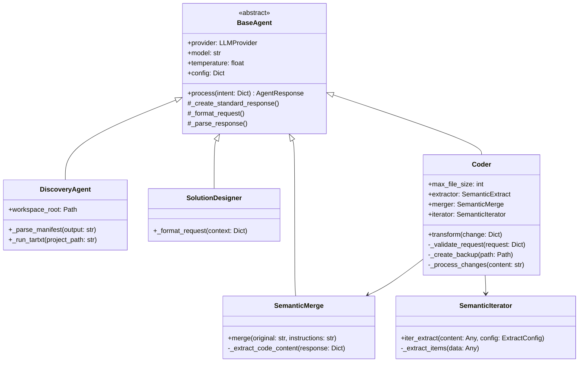
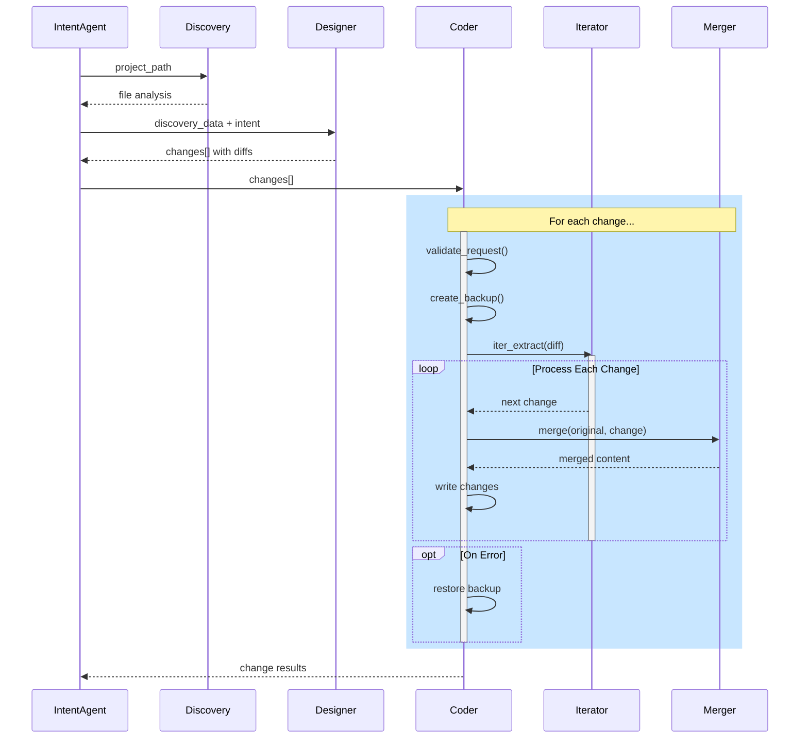
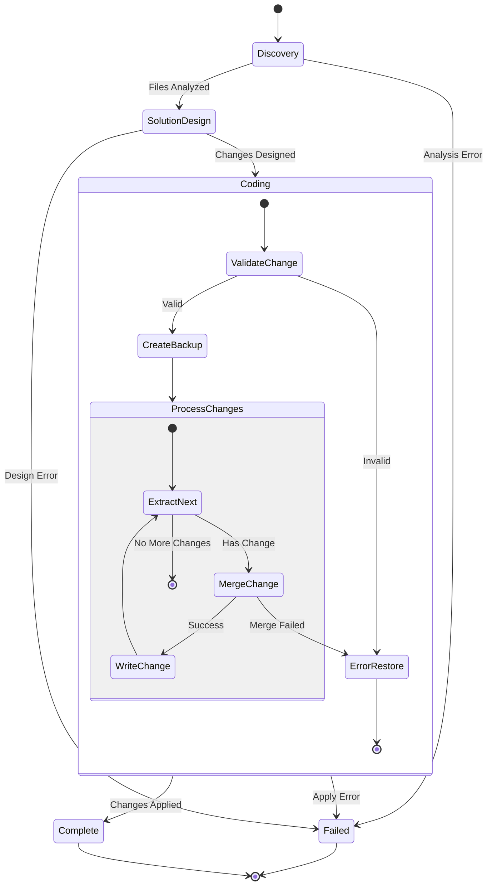

# Code Refactoring System Design

## Architecture Overview 
The code refactoring system uses a chain of specialized agents working together to analyze, design, and implement code changes:

1. **Discovery Agent** - Analyzes project structure
2. **Solution Designer** - Creates precise change specifications 
3. **Coder Agent** - Implements changes using semantic skills

Each agent maintains clear boundaries and follows minimal processing principles.

## Class Structure



## Processing Sequence



## State Transitions



## Detailed Component Behaviors

### Coder Agent Change Processing

The Coder agent processes changes through several specialized components:

1. **Change Validation**
```python
def _validate_request(self, request: Dict) -> Optional[str]:
    # Validates:
    # - Required fields (file_path, change_type, instructions)
    # - File path existence and format
    # - File size limits
    # - Valid change types (create, modify, delete)
```

2. **Backup Management**
```python
def _create_backup(self, file_path: Path) -> Optional[Path]:
    # Creates numbered backup: file.py.bak_001
    # Returns backup path or None if file doesn't exist
    # Used for rollback on errors
```

3. **Change Iterator Usage**
```python
async def _process_changes(self, content: str, instructions: str) -> str:
    # Configure iterator for changes
    changes_config = ExtractConfig(
        pattern="Extract each change from the instructions",
        format="json",
        validation={
            "requires_fields": ["type", "content", "location"]
        }
    )
    
    # Process changes sequentially
    iterator = await self.iterator.iter_extract(instructions, changes_config)
    modified_content = content
    
    while iterator.has_next():
        change = next(iterator)
        # Apply each change using merger
        merge_result = await self.merger.merge(modified_content, change["content"])
        if merge_result.success:
            modified_content = merge_result.content
```

4. **Semantic Merge Integration**
```python
async def transform(self, context: Dict[str, Any]) -> TransformResult:
    try:
        # 1. Validate request
        error = self._validate_request(context)
        if error:
            return TransformResult(success=False, error=error)

        # 2. Create backup
        backup_path = self._create_backup(file_path)
        
        try:
            # 3. Process changes
            modified_content = await self._process_changes(
                original,
                details["instructions"]
            )
            
            # 4. Write changes
            file_path.write_text(modified_content)
            
            return TransformResult(
                success=True,
                file_path=str(file_path),
                backup_path=str(backup_path)
            )
            
        except Exception as e:
            # 5. Restore from backup on error
            if backup_path:
                shutil.copy2(backup_path, file_path)
            raise
```

## Error Handling and Recovery

The system employs multiple levels of error handling:

1. **Agent Level**
   - Each agent captures and reports errors
   - Uses standard response format with error field
   - Logs errors for debugging

2. **Coder Level**
   - Creates backups before modifications
   - Restores from backup on error
   - Validates changes before applying
   
3. **Semantic Level**
   - Merger validates code validity
   - Iterator ensures change completeness
   - Both components provide detailed error info

## Key Design Principles

1. **Forward-Only Flow**
   - Data moves forward through agent chain
   - Each agent adds specific value
   - No backward dependencies

2. **Minimal Processing**
   - Agents focus on core tasks
   - Pass through data when possible
   - Let LLM handle complex decisions

3. **Error Recovery**
   - Backup before changes
   - Restore on failure
   - Clear error reporting

4. **State Tracking**
   - Consistent response format
   - Status tracking at each stage
   - Preserves raw LLM responses

This design provides a robust, maintainable system for automated code refactoring with clear boundaries between components and reliable error recovery mechanisms.