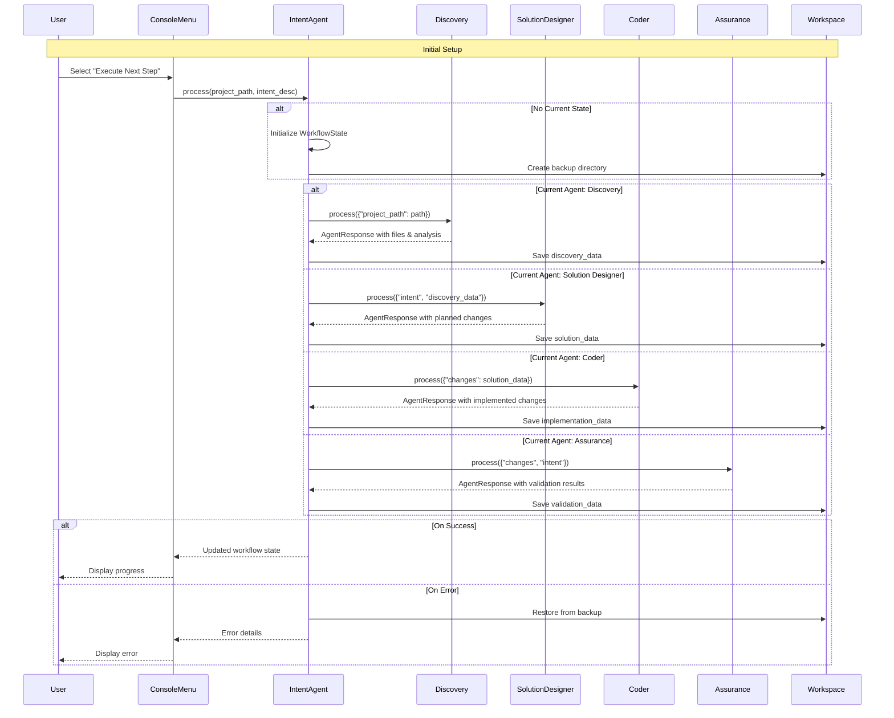
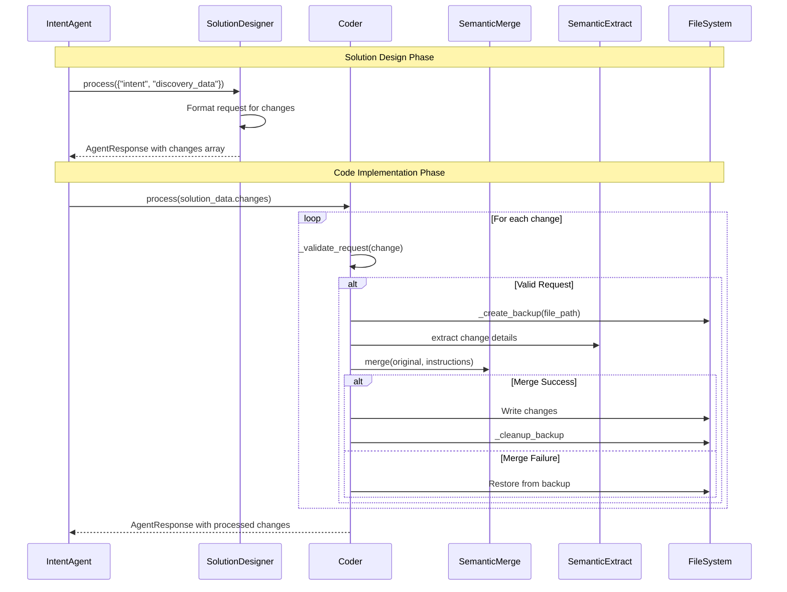
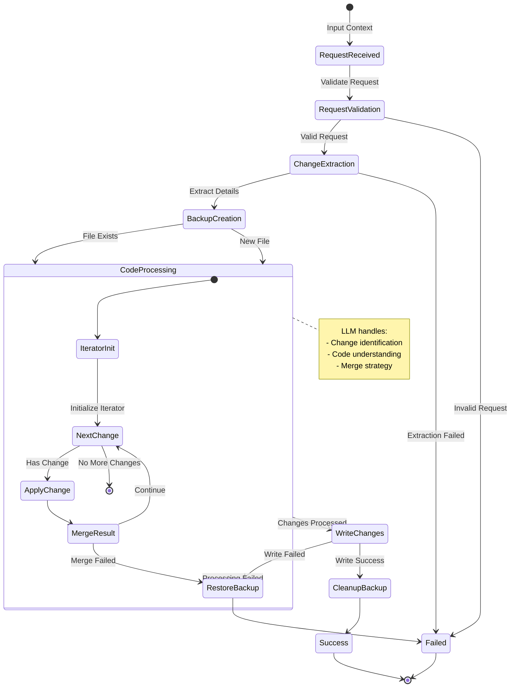
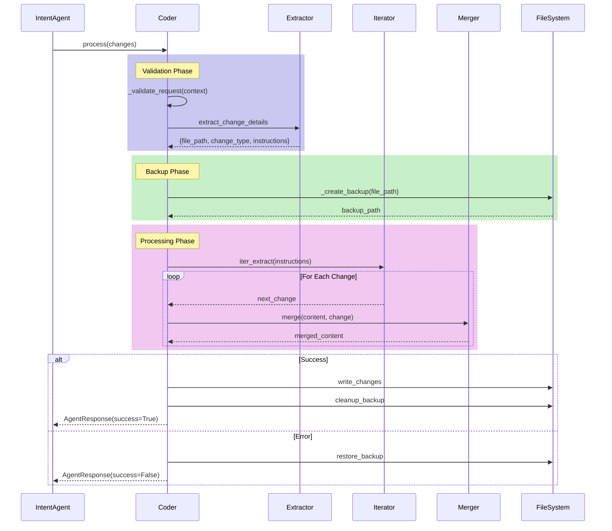

```mermaid
sequenceDiagram
    participant User
    participant ConsoleMenu
    participant IntentAgent
    participant Discovery
    participant SolutionDesigner
    participant Coder
    participant Assurance
    participant Workspace

    Note over User,Workspace: Initial Setup
    User->>ConsoleMenu: Select "Execute Next Step"
    ConsoleMenu->>IntentAgent: process(project_path, intent_desc)
    
    alt No Current State
        IntentAgent->>IntentAgent: Initialize WorkflowState
        IntentAgent->>Workspace: Create backup directory
    end

    alt Current Agent: Discovery
        IntentAgent->>Discovery: process({"project_path": path})
        Discovery-->>IntentAgent: AgentResponse with files & analysis
        IntentAgent->>Workspace: Save discovery_data
    else Current Agent: Solution Designer
        IntentAgent->>SolutionDesigner: process({"intent", "discovery_data"})
        SolutionDesigner-->>IntentAgent: AgentResponse with planned changes
        IntentAgent->>Workspace: Save solution_data
    else Current Agent: Coder
        IntentAgent->>Coder: process({"changes": solution_data})
        Coder-->>IntentAgent: AgentResponse with implemented changes
        IntentAgent->>Workspace: Save implementation_data
    else Current Agent: Assurance
        IntentAgent->>Assurance: process({"changes", "intent"})
        Assurance-->>IntentAgent: AgentResponse with validation results
        IntentAgent->>Workspace: Save validation_data
    end

    alt On Success
        IntentAgent-->>ConsoleMenu: Updated workflow state
        ConsoleMenu-->>User: Display progress
    else On Error
        IntentAgent->>Workspace: Restore from backup
        IntentAgent-->>ConsoleMenu: Error details
        ConsoleMenu-->>User: Display error
    end
```

```mermaid
sequenceDiagram
    participant IntentAgent
    participant SolutionDesigner
    participant Coder
    participant SemanticMerge
    participant SemanticExtract
    participant FileSystem

    Note over IntentAgent,FileSystem: Solution Design Phase
    IntentAgent->>SolutionDesigner: process({"intent", "discovery_data"})
    
    SolutionDesigner->>SolutionDesigner: Format request for changes
    SolutionDesigner-->>IntentAgent: AgentResponse with changes array

    Note over IntentAgent,FileSystem: Code Implementation Phase
    IntentAgent->>Coder: process(solution_data.changes)

    loop For each change
        Coder->>Coder: _validate_request(change)
        alt Valid Request
            Coder->>FileSystem: _create_backup(file_path)
            Coder->>SemanticExtract: extract change details
            Coder->>SemanticMerge: merge(original, instructions)
            
            alt Merge Success
                Coder->>FileSystem: Write changes
                Coder->>FileSystem: _cleanup_backup
            else Merge Failure
                Coder->>FileSystem: Restore from backup
            end
        end
    end

    Coder-->>IntentAgent: AgentResponse with processed changes
```

```mermaid
stateDiagram-v2
    [*] --> RequestReceived: Input Context
    
    RequestReceived --> RequestValidation: Validate Request
    RequestValidation --> ChangeExtraction: Valid Request
    RequestValidation --> Failed: Invalid Request
    
    ChangeExtraction --> BackupCreation: Extract Details
    ChangeExtraction --> Failed: Extraction Failed
    
    BackupCreation --> CodeProcessing: File Exists
    BackupCreation --> CodeProcessing: New File
    
    state CodeProcessing {
        [*] --> IteratorInit
        IteratorInit --> NextChange: Initialize Iterator
        NextChange --> ApplyChange: Has Change
        NextChange --> [*]: No More Changes
        ApplyChange --> MergeResult
        MergeResult --> NextChange: Continue
        MergeResult --> RestoreBackup: Merge Failed
    }
    
    CodeProcessing --> WriteChanges: Changes Processed
    CodeProcessing --> RestoreBackup: Processing Failed
    
    WriteChanges --> CleanupBackup: Write Success
    WriteChanges --> RestoreBackup: Write Failed
    
    CleanupBackup --> Success
    RestoreBackup --> Failed
    
    Success --> [*]
    Failed --> [*]

    note right of CodeProcessing
        LLM handles:
        - Change identification
        - Code understanding
        - Merge strategy
    end note
```

```mermaid
sequenceDiagram
    participant IntentAgent
    participant Coder
    participant Extractor
    participant Iterator
    participant Merger
    participant FileSystem
    
    IntentAgent->>Coder: process(changes)
    
    rect rgb(200, 200, 240)
        Note over Coder: Validation Phase
        Coder->>Coder: _validate_request(context)
        Coder->>Extractor: extract_change_details
        Extractor-->>Coder: {file_path, change_type, instructions}
    end

    rect rgb(200, 240, 200)
        Note over Coder: Backup Phase
        Coder->>FileSystem: _create_backup(file_path)
        FileSystem-->>Coder: backup_path
    end
    
    rect rgb(240, 200, 240)
        Note over Coder: Processing Phase
        Coder->>Iterator: iter_extract(instructions)
        
        loop For Each Change
            Iterator-->>Coder: next_change
            Coder->>Merger: merge(content, change)
            Merger-->>Coder: merged_content
        end
    end
    
    alt Success
        Coder->>FileSystem: write_changes
        Coder->>FileSystem: cleanup_backup
        Coder-->>IntentAgent: AgentResponse(success=True)
    else Error
        Coder->>FileSystem: restore_backup
        Coder-->>IntentAgent: AgentResponse(success=False)
    end
```