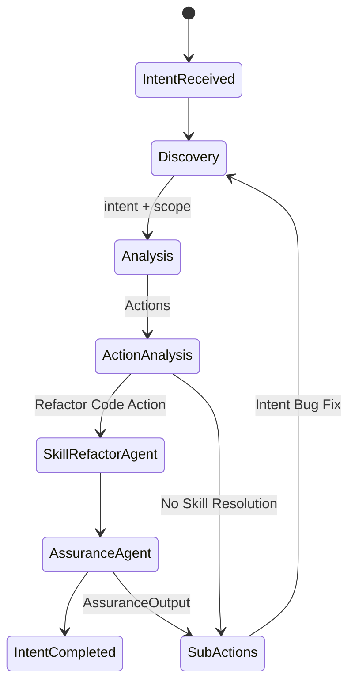

Here's a summary of the MVP we're building based on the Intent Architecture:
This is purely a functional description and needs to map onto Microsoft Autogen 0.3.1. for implementation.

1. **Core Goal**: 
Purpose is to build and refactor code according to an initial prompt 
    e.g. "Add logging to every function"

2. **Description**:
- IntentReceived - This is a structured message, but is just a compounded string
- Discovery
     - Role: This is an agent that runs a skill - returns scope which is the code base. For MVP uses tartxt.py
- Analysis
    - Role: Agent talking to an LLM to take intent + scope, use Claude3.5 Sonnet - Prompt is framed to return a set of Actions, that can be executed by a skill. e.g. for MVP merge code refactor.
    - e.g. "Add logging to every function, 
        'return refactored code as gitdiff, with the following format_definiton', format definition can then be passed to a simpler function which is the MergeSkill, that actually applies the code changes to the local file on disk.
- ActionAnalysis:
    - Role Agent takes "Actions", which is returned from Analysis Agent
    - It matches the Actions that can be applied based upon the format_definition, currently only a MergeSkill or Unknown.
    - The Actions that can be matched are passed to the appropriate Skill, MVP: MergeSkill only
- SkillRefactorAgent:
    - Role: Takes Merge Instructions, Merge Prompt, Merge Content, Destinaiton File Reference
    - Option 1, Runs a python merge program taking all the parameters and writes out the merged file
    - Option 2, Takes all parameters, passes to a simpler LLM to do the merge, and then writes the result out, Option 2 may be simpler because it can handle less deterministic merges.
- AssuranceAgent:
    - Role: Once all Refactoring Actions are completed, will call an Assurance skill, and compile (for languages that compile) or Run (as in python and javascript).
    - The Results of the Assurance
        - if successful will terminate that intent
        - if unsuccessful will become part of a new sub-Intent, the error message becomes the new intent which then goes back through the discovery process
        - effectively as long as Assurance fails it gets fed back to the Discovery process until it succeeds.

    