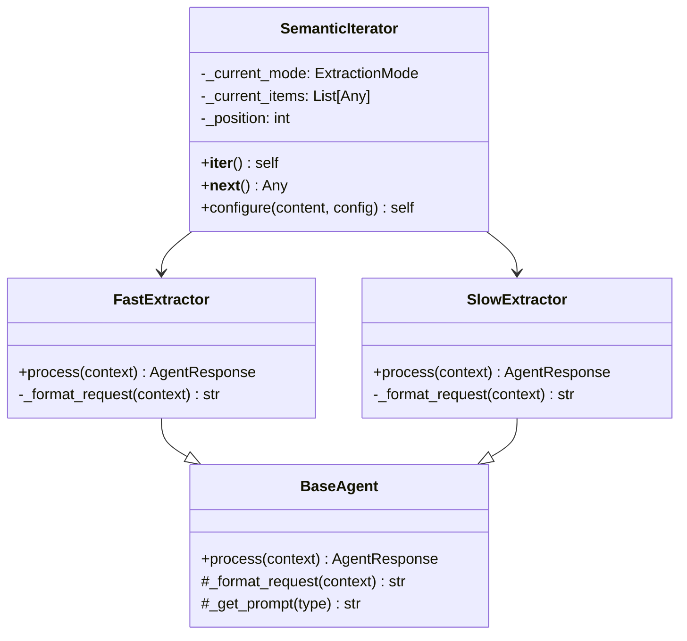
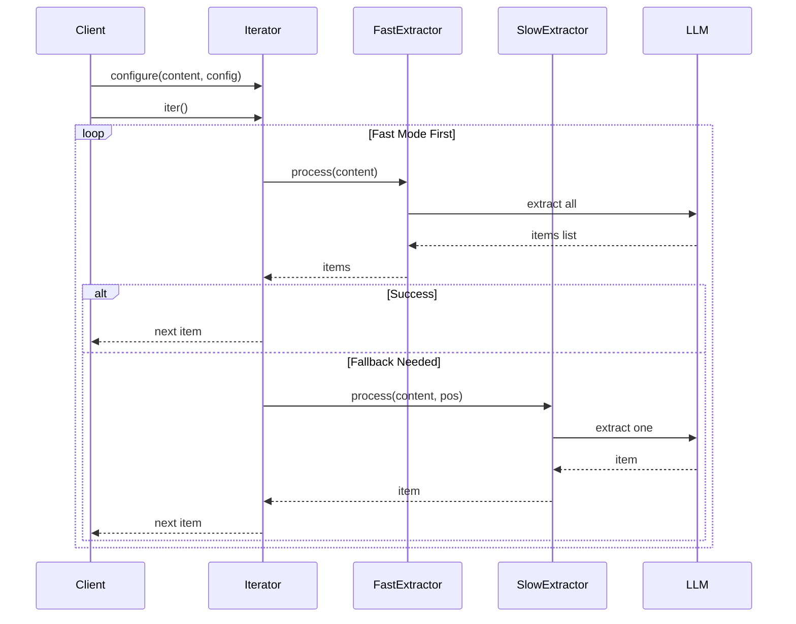

# Semantic Iterator System Design
Path: design/semantic_iterator_system.md

## Overview
The Semantic Iterator provides a standard Python iterator interface for extracting structured information from content using LLM capabilities. It encapsulates complex async LLM interaction while presenting a simple synchronous interface.

## Core Architecture



## Key Design Principles

1. **Synchronous Public Interface**
   - Standard Python iterator protocol
   - No async/await exposure
   - Simple configure/iterate pattern
   - Hides all LLM complexity

2. **Mode Encapsulation**
   - Fast mode for structured content
   - Slow mode for complex extraction
   - Automatic fallback handling
   - Mode-specific optimizations

3. **LLM First Design**
   - Minimal validation
   - Trust LLM responses
   - Focus on infrastructure
   - Clear separation of concerns

4. **State Management**
   - Clear state boundaries
   - Mode-specific state
   - Proper cleanup
   - Restart capability

## Component Responsibilities

### SemanticIterator
```python
class SemanticIterator:
    """Core iterator with standard interface"""
    def __iter__(self) -> Iterator:
        # Initialize state
        # Select initial mode
        return self

    def __next__(self) -> Any:
        # Handle fast mode with caching
        # Handle slow mode with position
        # Manage fallback as needed

    def configure(self, content: Any, config: ExtractConfig) -> None:
        # Set up for iteration
        # Reset state
```

### FastExtractor
```python
class FastExtractor(BaseAgent):
    """Bulk extraction specialist"""
    def process(self, context: Dict[str, Any]) -> AgentResponse:
        # Single LLM call
        # Return all items
        # Support JSON format
```

### SlowExtractor
```python
class SlowExtractor(BaseAgent):
    """Item-by-item extraction"""
    def process(self, context: Dict[str, Any]) -> AgentResponse:
        # Position-based extraction
        # Single item per call
        # NO_MORE_ITEMS detection
```

## Process Flow



## Implementation Strategy

1. **Mode Handling**
   ```python
   # State tracking
   self._current_mode = initial_mode
   self._position = 0
   self._current_items = None

   # Mode switching
   if not success and allow_fallback:
       self._current_mode = ExtractionMode.SLOW
       return self.__next__()
   ```

2. **Fast Mode**
   ```python
   # Cache all items on first access
   if not self._current_items:
       response = self._fast_extractor.process(...)
       self._current_items = json.loads(response.data['response'])

   # Return from cache
   return self._current_items[self._position]
   ```

3. **Slow Mode**
   ```python
   # Item-by-item extraction
   response = self._slow_extractor.process({
       'position': self._position,
       ...
   })

   if 'NO_MORE_ITEMS' in response:
       raise StopIteration
   ```

## Testing Strategy

1. **Behavior Tests**
   - Standard iteration protocol
   - Mode transitions
   - State management
   - Error handling

2. **Performance Tests**
   - Fast mode caching
   - Slow mode memory usage
   - Fallback overhead
   - LLM call patterns

3. **Integration Tests**
   - Real content extraction
   - Different formats
   - Error scenarios
   - Long sequences

## Error Handling

1. **Configuration Errors**
   - Missing content
   - Invalid config
   - Mode conflicts

2. **Extraction Errors**
   - LLM failures
   - Parse errors
   - Format mismatches

3. **State Errors**
   - Invalid position
   - Mode confusion
   - Cache corruption

## Metrics and Monitoring

1. **Performance Metrics**
   - Items extracted
   - Mode switches
   - LLM calls
   - Cache hits

2. **Error Metrics**
   - Failed extractions
   - Fallback frequency
   - Parse failures
   - State resets

3. **Usage Metrics**
   - Mode distribution 
   - Content types
   - Configuration patterns
   - Iterator lifecycle

## Configuration

```yaml
semantic_iterator:
  initial_mode: "fast"
  allow_fallback: true
  fast_extractor:
    prompt_template: |
      Extract all items from content...
  slow_extractor:
    prompt_template: |
      Extract item at position {position}...
```

## Best Practices

1. Always configure before iteration
2. Check mode transitions in logs
3. Monitor LLM call patterns
4. Handle NO_MORE_ITEMS properly
5. Clean up state between uses
6. Trust the LLM for content understanding
7. Focus on infrastructure over validation

## Usage Example

```python
# Initialize
iterator = SemanticIterator(...)

# Configure
iterator.configure(content, config)

# Use standard iteration
for item in iterator:
    process(item)
```

Would you like me to expand on any particular aspect of this design?