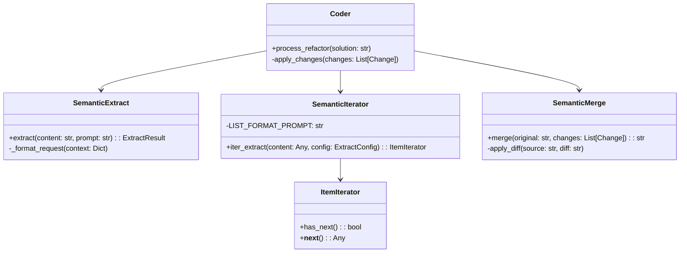
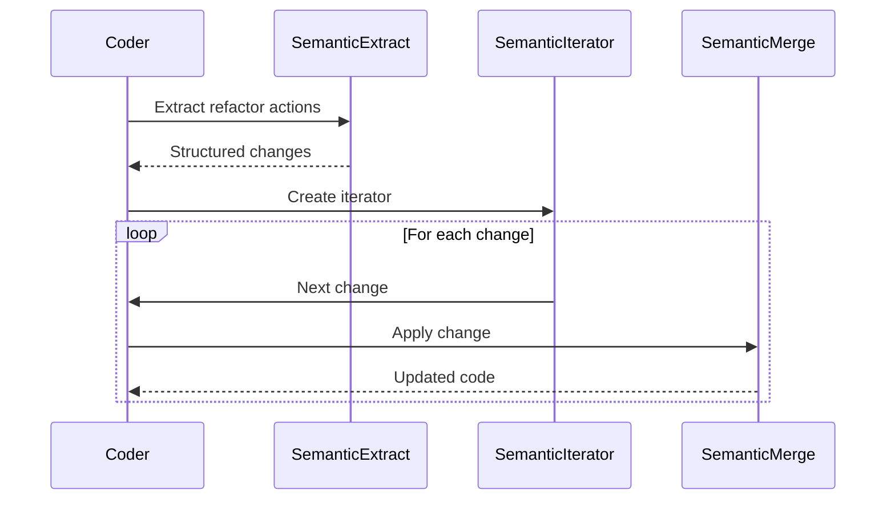

# Coder System Design

## Overview
Coder is an LLM-based code refactoring system using semantic operators to process and apply code changes.

## Core Components



## Process Flow



## Key Principles

1. LLM-First Processing
   - Minimal validation
   - Trust LLM output
   - Focus on infrastructure

2. Component Responsibilities
   - Extract: Parse solution into changes
   - Iterator: Process changes sequentially 
   - Merge: Apply changes to code

3. Data Flow
   - Solution Design → Changes List → Applied Changes

## Implementation Notes
- Uses inline prompts for extraction
- No cross-validation between components
- Maintains original content structure
- Handles both structured/unstructured input

# Semantic Iterator Design

## Core Components

1. **SemanticPrompt**
   - Instruction pattern to match
   - Expected output format (default: json)

2. **SemanticList[T]**
   - Generic container for extracted items
   - Provides length, indexing, iteration

3. **SemanticIterator[T]**
   - Async iterator implementation
   - Uses SemanticExtract for LLM-based extraction
   - Supports direct dictionary input

## Operation Flow

1. Iterator instantiated with:
   ```python
   SemanticIterator(config, content, prompt)
   ```

2. First `await iter` triggers:
   - Checks for direct item access (`changes`, `items`, `results`)
   - Otherwise extracts via LLM using prompt
   - Populates internal SemanticList

3. Iteration:
   ```python 
   async for item in iterator:
      process(item)
   ```

## Response Handling

- Direct dictionary -> List mapping
- Raw LLM output parsing
- Dict to key-value conversion 
- Error state returns empty list

## Usage Example
```python
iterator = SemanticIterator(
    config=llm_config,
    content=source_text,
    prompt=SemanticPrompt("Extract each {item} with fields...")
)
async for item in iterator:
    process(item)
```