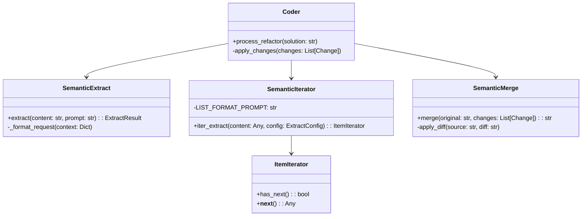
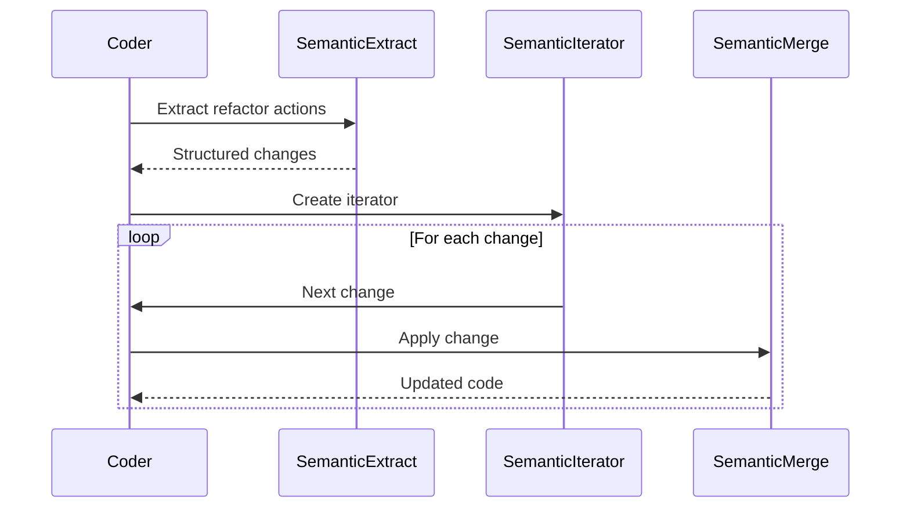
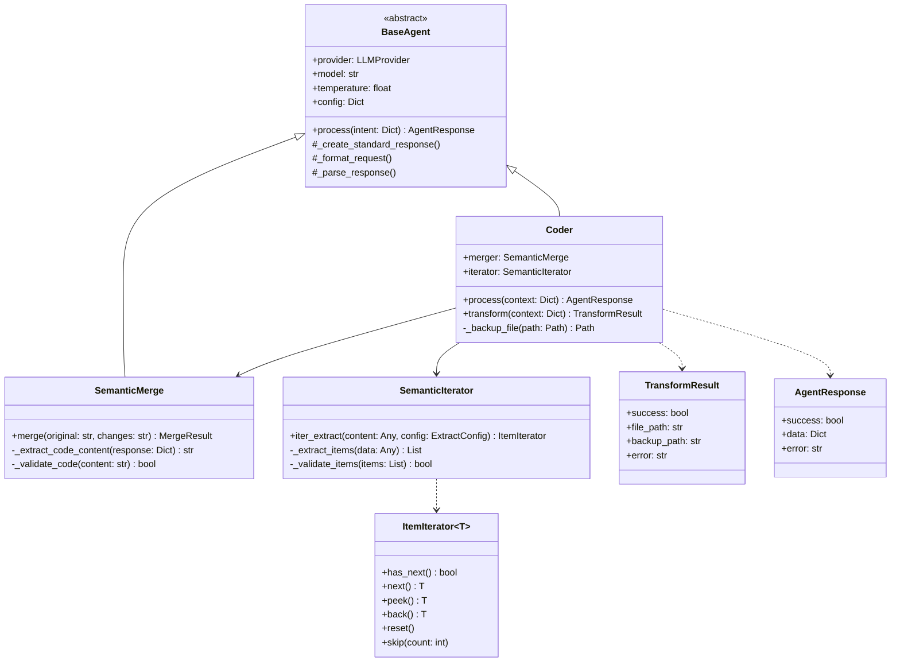
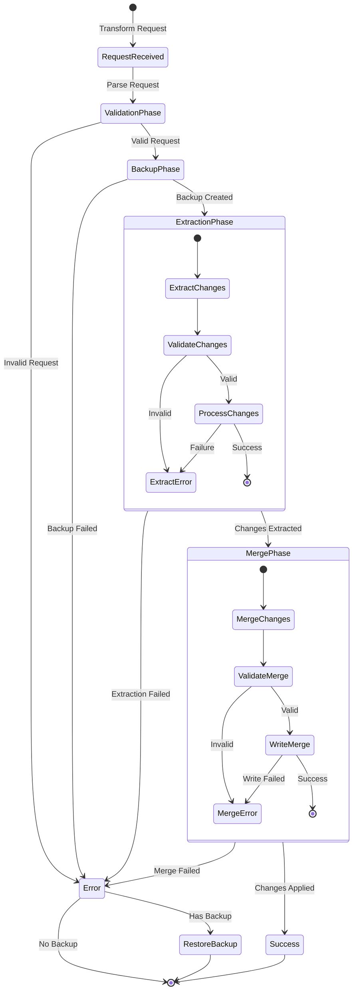

# Coder System Design

## Overview
Coder is an LLM-based code refactoring system using semantic operators to process and apply code changes.

## Core Components



## Process Flow



## Key Principles

1. LLM-First Processing
   - Minimal validation
   - Trust LLM output
   - Focus on infrastructure

2. Component Responsibilities
   - Extract: Parse solution into changes
   - Iterator: Process changes sequentially 
   - Merge: Apply changes to code

3. Data Flow
   - Solution Design → Changes List → Applied Changes

## Implementation Notes
- Uses inline prompts for extraction
- No cross-validation between components
- Maintains original content structure
- Handles both structured/unstructured input

# Semantic Iterator Design

## Core Components

1. **SemanticPrompt**
   - Instruction pattern to match
   - Expected output format (default: json)

2. **SemanticList[T]**
   - Generic container for extracted items
   - Provides length, indexing, iteration

3. **SemanticIterator[T]**
   - Async iterator implementation
   - Uses SemanticExtract for LLM-based extraction
   - Supports direct dictionary input

## Operation Flow

1. Iterator instantiated with:
   ```python
   SemanticIterator(config, content, prompt)
   ```

2. First `await iter` triggers:
   - Checks for direct item access (`changes`, `items`, `results`)
   - Otherwise extracts via LLM using prompt
   - Populates internal SemanticList

3. Iteration:
   ```python 
   async for item in iterator:
      process(item)
   ```

## Response Handling

- Direct dictionary -> List mapping
- Raw LLM output parsing
- Dict to key-value conversion 
- Error state returns empty list

## Usage Example
```python
iterator = SemanticIterator(
    config=llm_config,
    content=source_text,
    prompt=SemanticPrompt("Extract each {item} with fields...")
)
async for item in iterator:
    process(item)
```

### Additional Notes

Problem Space:
- Working with semantic iterator and extract for parsing structured data
- Test suite revealing issues with response handling
- Testing framework configuration challenges

Components at Play:

Semantic Iterator
Core Principles:
Acts as a list processor over semantic extractions
Works with BaseAgent for LLM interactions
Handles parsing and validation of responses
Provides iterator interface for extracted items

Semantic Extract (BaseAgent)
Key Functions:
Makes LLM API calls
Wraps responses in raw_output field
Handles retries and errors
Requires provider configuration and API keys
Key Issues Found:
1. Configuration Chain:

SemanticIterator -> SemanticExtract -> BaseAgent -> LiteLLM

- Missing env_var in config
- Authentication setup incomplete

```python
Response Structure: python
Response = {
 'raw_output': [  # Wrapper from BaseAgent
     {'name': 'DataProcessor', 'code': '...'}, 
     # More items...
 ]
}
```

LLM returns correct structure
Parser fails due to raw_output wrapper
Need to handle nested response format

Infrastructure:
Event loop management in tests
Fixture scoping and ordering
API key mocking
Main Learning Points:
1. Semantic iterator expects unwrapped JSON array responses
2. BaseAgent adds response wrapping we need to handle
3. Configuration needs complete provider setup including env vars
4. Test infrastructure needs proper async and mock setup

Next Steps Would Be:
1. Fix config structure
2. Handle response unwrapping 
3. Sort out test infrastructure
4. Then focus on parsing improvements

### More Design Notes


